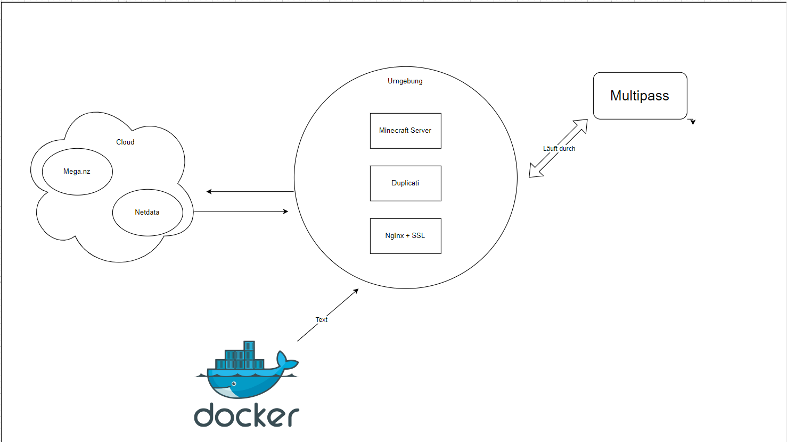
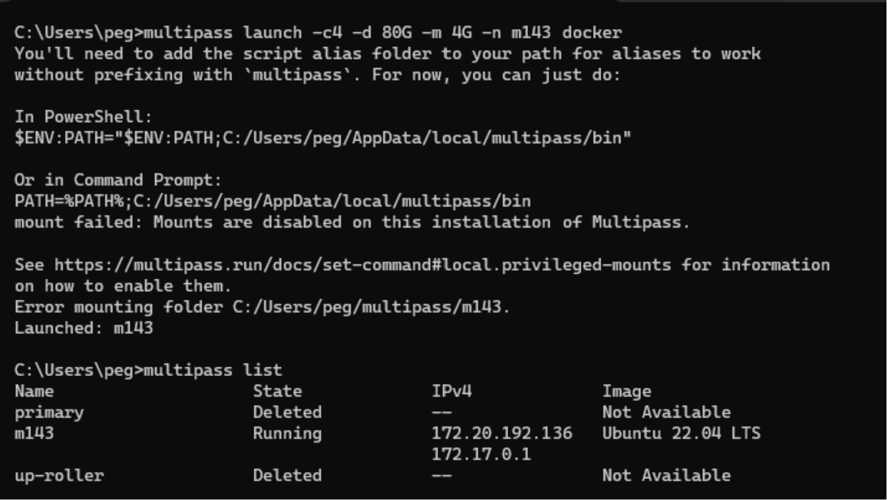
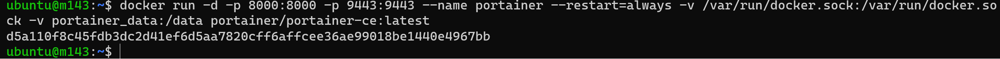
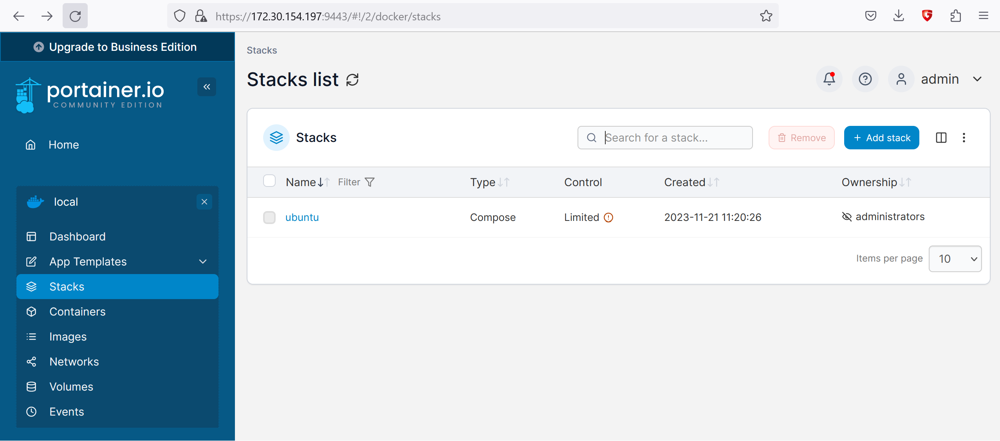
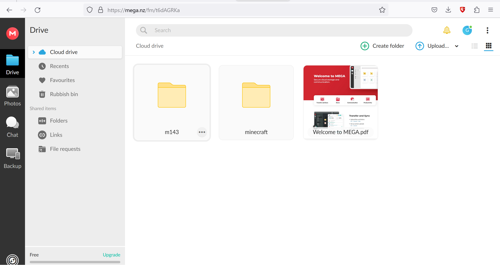
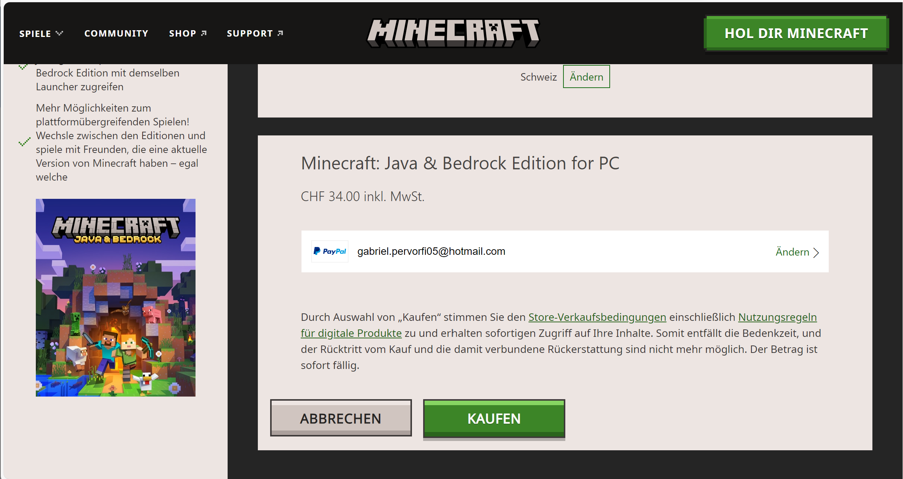

# M143
## Konzept:


Um die VM's und Testumgebungen zu erstellen, benutze ich dafür Multipass. Ich Betreibe einen Minecraft Server. Ich benutze die Cloud Mega.nz und dazu noch einen Docker für mehr sicherheit, da ich dort die Umgebung isolieren kann. Duplicati benutz ich da man mit der Applikation Backups verschlüsseln und in die Cloud speichern kann. Netdata wird für die Überwachung verwendet.

## Schritt 2. VM Erstellen.

Ich habe als erstes eine VM auf Mutlipass erstellt. Dafür muss Mutlipass schon installiert und anwendungsbereit sein. Multipass kann man hier installieren:

https://multipass.run/docs/installing-on-windows#heading--install-upgrade-uninstall

Wenn dies gemacht ist, müssen wir das CMD öffnen und können uns dann dort unsere erste VM erstellen. Dies machen wir mit diesem Befehl:

### multipass launch -c4 -d 80G -m 4G -n m143 docker

multipass launch: Dieser Teil des Befehls startet eine neue virtuelle Maschine (VM) mit Multipass.

-c4: Dieser Parameter gibt an, dass die VM über 4 CPUs (Kerne) verfügen soll.

-d 80G: Dieser Parameter legt die Größe der virtuellen Festplatte auf 80 Gigabyte (GB) fest.

-m 4G: Dieser Parameter gibt den VM 4 Gigabyte (GB) Arbeitsspeicher (RAM).

-n m143: Dieser Parameter weist der VM einen Namen zu, in diesem Fall "m143".

docker: Dieser Teil des Befehls gibt an, dass Docker in der virtuellen Maschine installiert werden soll.



Wie man im Screenshot sieht, kann man mit "multipass List" kontrollieren, ob die instanz wirklich erstellt wurde. Die Ip Adresse sieht man auch durch diesen Befehl und Allgemein alle erstellten instanzen.


Mit dem Befehl "docker version", sieht man welche docker version man heruntergeladen hat oder ob eine schon existiert. Dies haben wir schon heruntergeladen, bei erstellen der VM.

Als nächstes kann mann die VM gestartet.

Command: multipass shell m143


Wenn dies funktioniert hat, kann ein nano file mit den Konfigs für duplicati und den Mincarft-Server erstellt werden. Um so ein File erstellen zu können, habe ich die 2 Anleitungen als hilfe benutzt:

https://docker-minecraft-server.readthedocs.io/en/latest/#using-docker-compose

https://docs.linuxserver.io/images/docker-duplicati/#usage

So sieht das nano File zum schluss aus:
```yaml
version: "3.7"
services:
  mc:
    image: itzg/minecraft-server
    tty: true
    stdin_open: true
    ports:
      - "25565:25565"
    environment:
      EULA: "TRUE"
    volumes:
      - /home/ubuntu/minecraft_data:/data
  duplicati:
    image: lscr.io/linuxserver/duplicati:latest
    container_name: duplicati
    environment:
      - PUID=1000
      - PGID=1000
      - TZ=Etc/UTC
    volumes:
      - /home/ubuntu/duplicati/appdata/config:/config
      - /home/ubuntu/duplicati/backups:/backups
      - /home/ubuntu/duplicati/source:/source
      - /home/ubuntu/minecraft_data:/minecraft_data
    ports:
      - 8200:8200
    restart: unless-stopped
```


## Schritt 3. Contrainer starten

Um die Container starten zu können, müssen wir den Befehl "sudo docker compose up" eingeben.


Man kann es auch im Hintergrund laufen lassen, was ich empfehlen würde.


Wenn dies gemacht ist, kann man mit der IP der VM und den richtigen Port auf duplicati. Die IP kann man mit multipass list sehen und den Port kann man auf der Config file sehen, das wir vorher benutzt haben.


```yaml
container_name: duplicati
    environment:
      - PUID=1000
      - PGID=1000
      - TZ=Etc/UTC
    volumes:
      - /home/ubuntu/duplicati/appdata/config:/config
      - /home/ubuntu/duplicati/backups:/backups
      - /home/ubuntu/duplicati/source:/source
      - /home/ubuntu/minecraft_data:/minecraft_data
    ports:
      - 8200:8200
    restart: unless-stopped
```


## Schritt 4.Portainer erstellen

https://docs.portainer.io/start/install-ce/server/docker/linux

Auf dieser Website habe ich den Befehl gefunden um portainer zu installieren.



mit "sudo docker container ls" kann man sehen welcher Port verwendet wird. In diesem fall der Port 9443.





## Schritt 5. Mega.nz einrichten

Auf der Website werden wir die Daten / Ressourcen des Minecraft Servers backupen. Dafür müssen wir uns erst einen Account auf Mega.nz machen.

Dies kann man hier: https://mega.nz

Sobald man sich eingerichtet hat, müssen wir einen Ordner erstellen. Darauf werden unsere Minecraft Daten dann gespeichert. 



## Schritt 6. Minecraft server starten

um den Server starten zu können, brauchen wir dafür Minecraft.

dies habe ich auch gekauft auf der Offizellen Minecraft seite: https://www.minecraft.net



als nächstes müssen wir uns mit dem Server verbinden. 

Die Bedingungen:

  - Dafür muss der Server Laufen, indem wir die Container starten

  

  - Minecraft starten und bei add server die IP Adresse eingeben.

  

Sobald dies funktioniert hat, ladet das Spiel. Um zu überprüfen, ob das Backup funktioniert, sollte man einen block platzieren und dann sich wieder disconnecten.


Als nächstes müssen wir auf Duplicati und können das Backup sofort starten, in dem wir auf "run now" klicken.


sobald das backup fertig ist, Kann man wieder ins Spiel und man sollte dann wieder am gleichen ort wieder sein und die Dateien sollten auf Mega.nz gespeichert sein.


Probleme:

Ich konnte am 09.01 duplicati nicht mehr öffnen. Die VM war gestartet wie auch die Container. Deshalb habe ich im portainer den container genauer angeschaut. Das Netzwerk war auf ubuntu_default eingestellt, weshalb ich die website im browser nicht Aufrufen konnte. Ich habe ein bisschen recherchiert und diesen Beitrag gefunden:
https://stackoverflow.com/questions/43754095/how-to-join-the-default-bridge-network-with-docker-compose-v2

Mit den Informationen habe ich das Docker file so angepasst, das der Netzwerk default für alle container auf Bridge eingestellt ist. Es hat funktioniert.

Für eine Zusätzliche sicherheit, habe ich einen Recovery Key für meinen Mega.nz account. den Speichere ich auf einem Externen USB-Stick.


