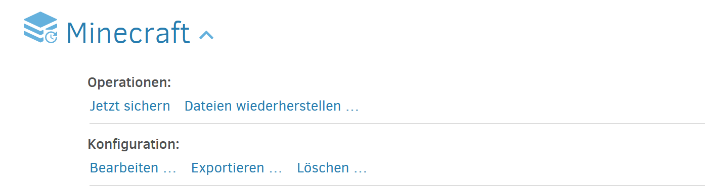

## Recovery durchführung

Da das Backup funktioniert, muss noch getestet werden ob es in einem Fall von komplettem Datenverlust, wir die Daten wiederherstellen können.

Dafür musste ich erst auf meiner Aktuellen VM, auf Duplicati und mein Minecraft Backup aufklappen. Dort hatte ich die Option unter Konfiguration, Exportieren auszuwählen.

Als nächstes konnte man es als Befehl für Kommandozeile oder als Datei exportieren. Ich wählte als Datei. Hier kann noch entschieden werden, ob, die Datei verschlüsselt und als Passwort exportiert werden sollte. Ich würde aus Sicherheitsgründen, beides auswählen.

Sobald auf Exportieren geklickt wurde, wird die Configdatei Heruntergeladen.

