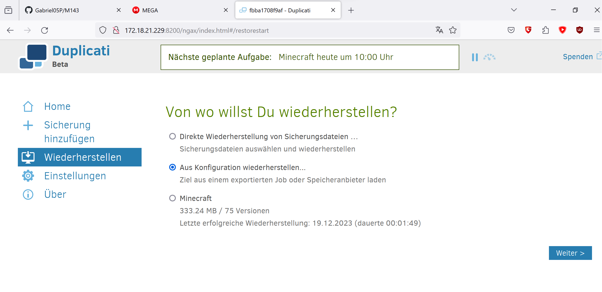

## Recovery durchführung

**Weitere Unterlagen:**

die UserStory, ist hier zu finden: [Usecase](usecase.md)

Die Betriebsdokumentation, ist hier zu finden: [Betriebsdokumentation](README.md)

Das Datenschutzkonzept, ist hier zu finden: [Datensicherungskonzept](Datensicherungskonzept.md)

## Durchführung:

Da das Backup funktioniert, muss noch getestet werden ob es in einem Fall von komplettem Datenverlust, wir die Daten wiederherstellen können.

Dafür musste ich erst auf meiner Aktuellen VM, auf Duplicati und mein Minecraft Backup aufklappen. Dort hatte ich die Option unter Konfiguration, Exportieren auszuwählen.

Als nächstes konnte man es als Befehl für Kommandozeile oder als Datei exportieren. Ich wählte als Datei. Hier kann noch entschieden werden, ob, die Datei verschlüsselt und als Passwort exportiert werden sollte. Ich würde aus Sicherheitsgründen, beides auswählen.

Sobald auf Exportieren geklickt wurde, wird die Configdatei Heruntergeladen.

Jetzt habe ich die Nötige Datei, um einen Restore zu ermöglichen.

## Teil 2 VM erstellen

Im 2.Teil werde ich eine weiter VM erstellen. Wir gehen davon aus das wir alle Daten und Backups verloren haben. Deshalb müssen wir wieder eine neue VM erstellen. 

Die Neue VM bekommt den namen m143-Recovery.
Dies wird mit dem Befehl auf der Commandozeile durchgeführt:

#### Multipass multipass launch -c4 -d 80G -m 4G -n m143-Recovery docker

Die VM kann mit "Multipass shell m143-Recovery" gestartet werden.

Sobald dies funktioniert hat, müssen wir das docker-compose file wiederherstellen. Dies erledigen wir indem wir ein neues nano file öffnen.

#### nano docker-compse.yaml

dort geben wir wieder die Konfigurationen ein, die wir schon bei der ersten VM bestimmt haben.

Die Container können danach gestartet werden. mit dem Befehl:

#### sudo docker compose up -d

Als nächstes muss duplicati geöffnet werden. wir nehmen die IP der neuen VM und den Port von duplicati also 8200.

Um unsere Backups wiederherzustellen, müssen wir hier auf Wiederherstellen und aus Konfiguration  wiederherstellen auswählen.

Hier müssen wir die Config Datei einfügen, die wir vorhin heruntergeladen haben.

Dann kann man auf Importieren. Hier wird das alte Setup dann gezeigt, das wir ganz am anfang eingerichtet haben also wieder die Originale Version.

Das Recovery datum kann auch ausgewählt werden.

Der letzte schritt, sind die Wiederherstellungsoptionen, die wir so lassen können oder einen bestimmten Speicherort auswählen. In diesem fall lassen wir die Default einstellungen.

Sobald auf Wiederherstellen geklickt wurde, muss man kurz warten und dann sollte die Nachricht kommen das es erfolgreich war, wie im Screenshot.

Das Wiederherstellen war erfolgreich. Jetzt müssen wir das Backup wiederhinzufügen, indem wir "aus Sicherung hinzufügen" drücken und dort "von einer Datei importieren" auswählen

Hier kann man due Datei hinzufügen.

sobald man das Backup hinzugefügt hat, kann Minecraft gestartet werden, und man sollte wieder im gleichen Spielstand sein.

Hier noch ein Screenshot, das alles gestartet ist.

Dann können wir Minecraft starten und die Ip adresse des Servers eintragen und uns verbinden. Wenn alles geklappt hat landet man wieder im gleichen spielerstand wie davor.

](<minecraft m143 Recorvery.png>)

